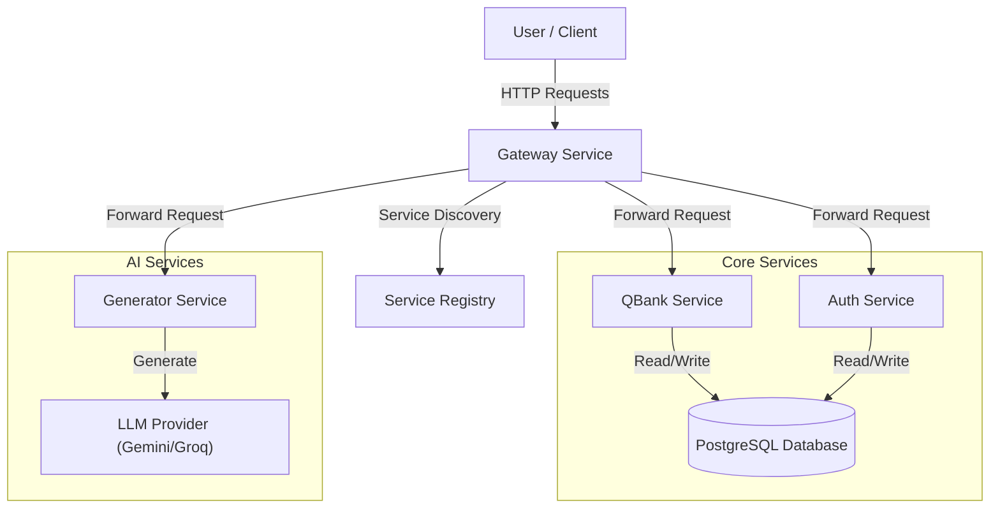
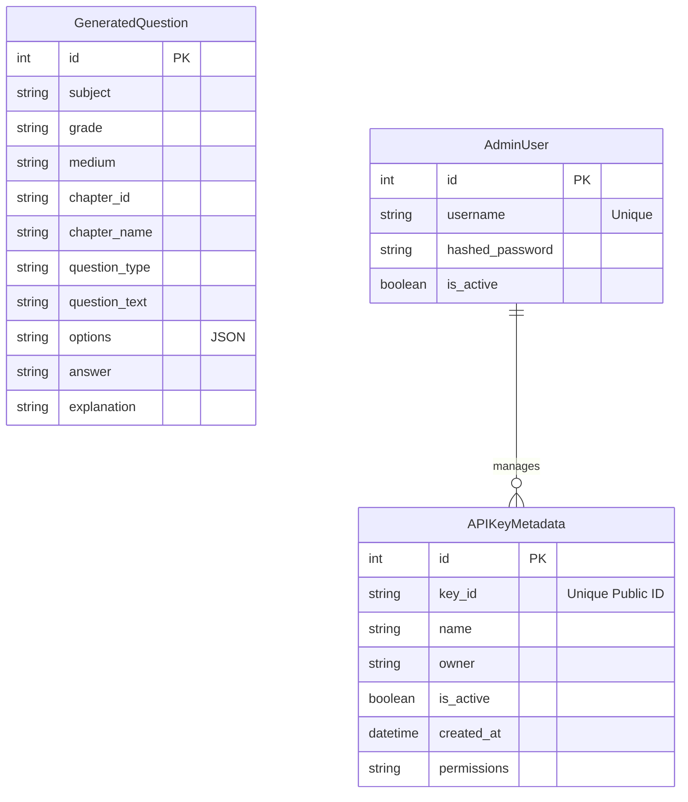

# Architecture

The Question Generation Engine follows a microservices architecture to decouple generation logic from storage, serving, and authentication.

## System Overview

## Data Schema

The system uses a shared PostgreSQL database. Below is the Entity-Relationship Diagram (ERD) representing the core data models.

### Table Details

#### 1. `GeneratedQuestion`

Stores the generated questions retrieved from the Generator service.

- **subject**, **grade**, **medium**: Metadata for categorization.
- **question_type**: Type of question (e.g., `mcq`, `fill_in_the_blank`, `structured`).
- **options**: JSON string storing choices for MCQs or word banks.
- **answer**: The correct answer (string/JSON).
- **explanation**: Detailed explanation in MDX format.

#### 2. `AdminUser`

Stores internal admin users who can manage the system and generate API keys.

- **username**: Unique identifier for login.
- **hashed_password**: Securely hashed password.

#### 3. `APIKeyMetadata`

Tracks issued API keys for external clients (e.g., Mobile App, Frontend).

- **key_id**: The public identifier for the key (embedded in the JWT).
- **permissions**: Comma-separated string of allowed scopes.

## Components

### 1. Gateway Service

- **Port**: 8000
- **Role**: Entry point for all client requests. Handles routing, service discovery, authentication verification, and aggregation.
- **Key Endpoints**:
  - `/questions`: List questions from QBank.
  - `/generate`: Trigger generation via Generator.
  - `/auth/*`: Proxy to Auth service.
  - `/registry/*`: Manage service registration.

### 2. Service Registry

- **Role**: In-memory registry within the Gateway.
- **Mechanism**:
  - Dynamic Registration: Services register themselves upon startup via the `lifespan` event.
  - Health Checks: The Gateway monitors registered services.
  - **Retry Logic**: Services attempt to register multiple times (with backoff) if the Gateway is initially unavailable.

### 3. QBank Service

- **Default Port**: 8002
- **Role**: Manages the persistent storage of questions.
- **Functionality**: CRUD operations for `GeneratedQuestion` entities.

### 4. Generator Service

- **Default Port**: 8004
- **Role**: Interface with AI models to generate content.
- **Functionality**: Receives syllabus content or PDF files, constructs prompts for the LLM, and returns structured JSON responses.

### 5. Auth Service

- **Default Port**: 8005
- **Role**: Manages identity and access control.
- **Functionality**:
  - Admin login (`/token`).
  - API Key management (Create/Revoke).
  - Token verification endpoint (`/verify`) used by the Gateway.
