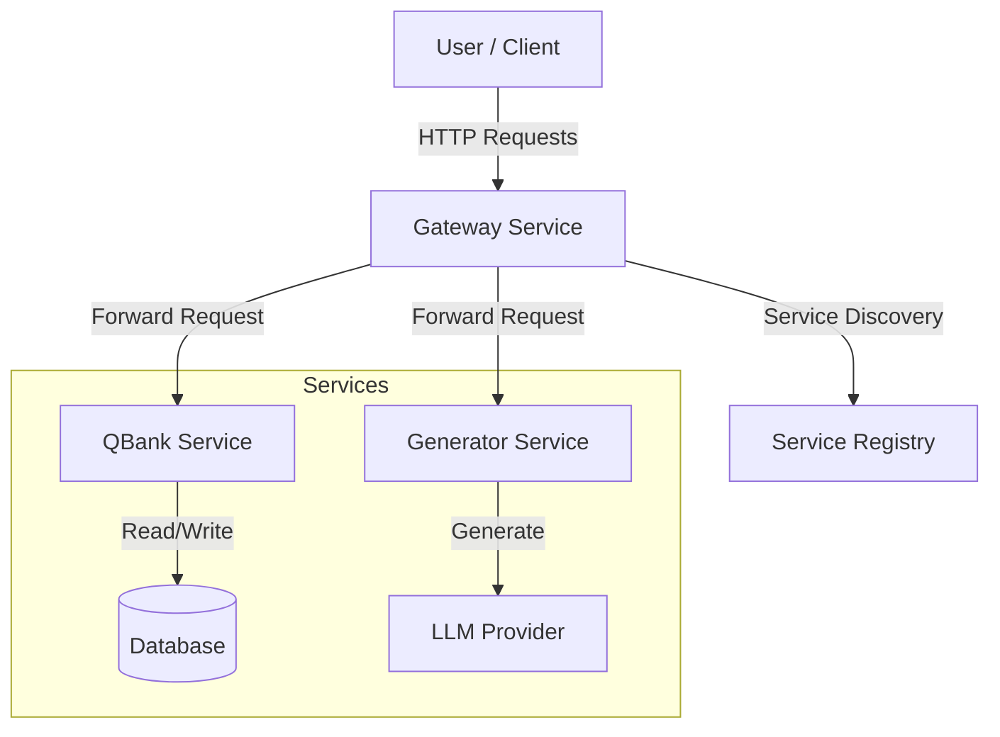

# Architecture

The Question Generation Engine follows a microservices architecture to decouple generation logic from storage and serving.

## Overview

## Components

### 1. Gateway Service

- **Port**: 8000
- **Role**: Entry point for all client requests. Handles routing, service discovery, and aggregation.
- **Key Endpoints**:
  - `/questions`: List questions from QBank.
  - `/generate`: Trigger generation.
  - `/registry/*`: Manage service registration.

### 2. Service Registry

- **Role**: In-memory registry within the Gateway.
- **Mechanism**: Services register themselves upon startup (`lifespan` event) and deregister on shutdown.

### 3. QBank Service

- **Default Port**: 8002
- **Role**: Manages the persistent storage of questions.
- **Functionality**: Creating, reading, updating, and deleting questions.

### 4. Generator Service

- **Default Port**: 8004
- **Role**: interfacing with AI models to generate content.
- **Functionality**: Receives syllabus content or PDF text, prompts the LLM, and returns structured questions.
